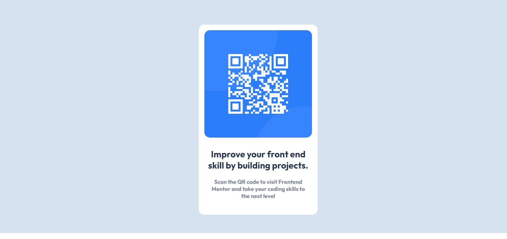
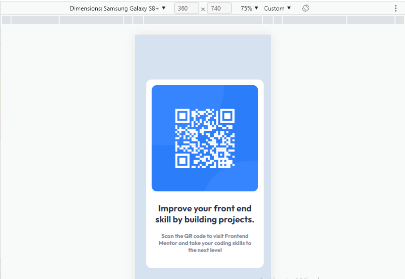

# FrontMentorQRCode# Frontend Mentor - QR code component solution

This is a solution to the [QR code component challenge on Frontend Mentor](https://www.frontendmentor.io/challenges/qr-code-component-iux_sIO_H). Frontend Mentor challenges help you improve your coding skills by building realistic projects. 

## Table of contents

- [Frontend Mentor - QR code component solution](#frontend-mentor---qr-code-component-solution)
  - [Table of contents](#table-of-contents)
  - [Overview](#overview)
    - [Screenshot](#screenshot)
    - [Links](#links)
  - [My process](#my-process)
    - [Built with](#built-with)
    - [What I learned](#what-i-learned)
  - [Author](#author)
  - [Acknowledgments](#acknowledgments)

## Overview

I have some knowledge developing web sites so replicating this QR Code Project was quiet easy just add few elements and css classes.

### Screenshot




Add a screenshot of your solution. The easiest way to do this is to use Firefox to view your project, right-click the page and select "Take a Screenshot". You can choose either a full-height screenshot or a cropped one based on how long the page is. If it's very long, it might be best to crop it.

Alternatively, you can use a tool like [FireShot](https://getfireshot.com/) to take the screenshot. FireShot has a free option, so you don't need to purchase it. 

Then crop/optimize/edit your image however you like, add it to your project, and update the file path in the image above.


### Links

- Solution URL: (https://github.com/rapric2115/FrontMentorQRCode)
- Live Site URL: (https://rapric2115.github.io/frontmentorqrcode)

## My process

 So what i did first was read all the documentation, the style guide and looked all file. At the Beginner I was thinking replicate this project using React but I decide to do it with HTML and CSS only, so what i did first was create a style.css file and connected to index.html, so I change the body background to light gray, them make a div container for the QR and make the background completely white and adjust the width and height as decide.

 The next step was the QR image, I place the image in the center of the QR container put then a borders radius, the an H2 heading elements and a paragraph styled as I saw it in the design provided.

 In Summary replicating this design wasn't so hard a all, just want to know from 1 to 10 how much you think I'll get.

### Built with

- Semantic HTML5 markup
- CSS custom properties
- Flexbox
- Mobile-first workflow

### What I learned

What I learn is how to use correctly flexbox, and center elements using flex and align items, content, self. 

To see how you can add code snippets, see below:

```html
<h1>Some HTML code I'm proud of</h1>
```
```css
.proud-of-this-css {
  color: papayawhip;
}
```
```js
const proudOfThisFunc = () => {
  console.log('🎉')
}
```

If you want more help with writing markdown, we'd recommend checking out [The Markdown Guide](https://www.markdownguide.org/) to learn more.


## Author

- Website - (https://raphaelrichardsonb.web.app)
- Frontend Mentor - (https://www.frontendmentor.io/profile/rapric2115)
- github - (https://github.com/rapric2115)

## Acknowledgments

Never stop learning, never say no, I can't. Just keep following your dreams.
